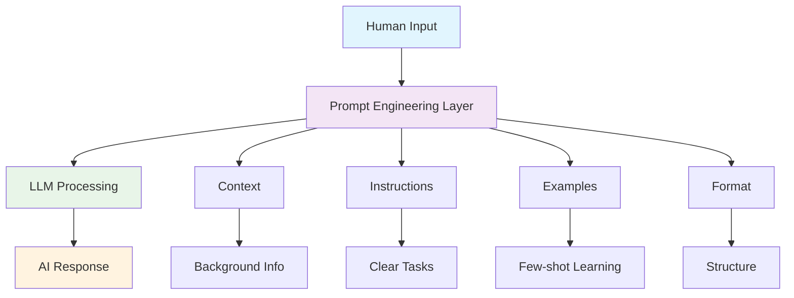
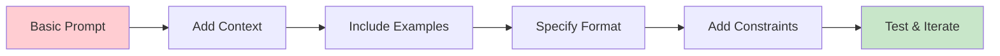

# 🚀 Module 1: Basics of Prompting

> *"The art of communicating with AI - where every word matters and every instruction shapes the outcome."*

---

## 🎯 Learning Objective (OBE)

**By the end of this module, you will be able to:**
- Understand the fundamental structure and components of effective prompts
- Distinguish between zero-shot and few-shot prompting techniques
- Craft clear, context-rich prompts that yield predictable AI responses
- Apply prompt engineering principles to real-world enterprise scenarios
- Recognize common prompt formatting patterns and best practices

---

## 🧠 Concept Definition & Explanation

### What is Prompting?
**Prompting** is the process of providing instructions, questions, or context to a Large Language Model (LLM) to elicit specific responses or behaviors. Think of it as the "user interface" between humans and AI - the bridge that translates human intent into AI action.

### Enterprise Relevance
In today's enterprise landscape, effective prompting is crucial for:
- **Customer Service**: Automating support responses with consistent quality
- **Content Generation**: Creating marketing materials, reports, and documentation
- **Code Development**: Generating boilerplate code and debugging assistance
- **Data Analysis**: Interpreting complex datasets and generating insights
- **Training & Onboarding**: Creating personalized learning experiences

---

## 📊 Visual Diagram: Prompt Anatomy



---

## 🔍 Infographic-style Breakdown

### Prompt Components Breakdown

| 🧩 **Component** | 📝 **Description** | 💡 **Example** |
|------------------|-------------------|----------------|
| **🎯 Instruction** | Clear task definition | "Complete the sentence:" |
| **📚 Context** | Background information | "Given a customer complaint..." |
| **📋 Examples** | Demonstration cases | "Input: X → Output: Y" |
| **🏗️ Format** | Response structure | "Answer in bullet points" |
| **⚙️ Constraints** | Limitations/requirements | "Keep under 100 words" |

### Prompt Evolution Process



---

## 📝 Examples: Good vs. Bad Prompts

### ❌ **Bad Prompt Example**
```
Prompt: The sky is
Output: blue.
```
**Problems:**
- No clear instruction
- Ambiguous context
- Unpredictable output
- No task definition

### ✅ **Improved Prompt Example**
```
Prompt: Complete the sentence with a natural continuation:
The sky is

Output: blue during the day and dark at night.
```
**Improvements:**
- Clear instruction ("Complete the sentence")
- Context ("natural continuation")
- Predictable, task-aligned output

### 🔄 **Enterprise Transformation Example**

#### Before (Poor):
```
"Write about AI"
```

#### After (Professional):
```
"Write a 200-word executive summary explaining how AI can improve customer service operations for a Fortune 500 retail company. Include specific use cases and ROI considerations. Format as bullet points."
```

---

## 📚 Cheat Sheet Recap

### ⚡ **Prompt Engineering Fundamentals**

| **Element** | **Purpose** | **Format** |
|-------------|-------------|------------|
| **Question Format** | Direct queries | `Q: <Question>?` |
| **Instruction Format** | Task-based prompts | `<Instruction>` |
| **Zero-shot** | No examples | Direct question |
| **Few-shot** | With examples | Q&A pairs |

### ✅ **Best Practices Checklist**

- [ ] **Be Specific**: Clear, unambiguous instructions
- [ ] **Provide Context**: Relevant background information
- [ ] **Include Examples**: Show desired output format
- [ ] **Set Constraints**: Define length, style, format
- [ ] **Test Iteratively**: Refine based on results
- [ ] **Use Clear Language**: Avoid jargon and ambiguity

### ❌ **Common Pitfalls**

- [ ] **Vague Instructions**: "Write something good"
- [ ] **Missing Context**: No background information
- [ ] **Unclear Format**: No output structure specified
- [ ] **Over-complication**: Too many requirements
- [ ] **Inconsistent Examples**: Mixed demonstration styles

---

## 🧪 Interactive Lab (PBL)

### **Hands-on Exercise: Prompt Transformation**

**Objective**: Transform a basic prompt into an enterprise-ready version

#### **Step 1: Analyze the Bad Prompt**
```
"Tell me about coding"
```

#### **Step 2: Identify Problems**
- ❌ Too vague
- ❌ No context
- ❌ No format specification
- ❌ No constraints

#### **Step 3: Transform Step-by-Step**

**Add Context:**
```
"Tell me about coding for a junior developer who wants to learn Python"
```

**Add Specificity:**
```
"Explain the basics of Python programming for a junior developer"
```

**Add Format:**
```
"Explain the basics of Python programming for a junior developer. Provide 5 key concepts with examples."
```

**Add Constraints:**
```
"Explain the basics of Python programming for a junior developer. Provide 5 key concepts with examples. Keep each explanation under 2 sentences."
```

#### **Step 4: Test Your Prompt**
Try this final version in any LLM playground and compare the results!

---

## 🎯 Mini-Project: Department-Specific Application

### **Choose Your Department Challenge:**

#### **💻 Software Development**
**Task**: Create a prompt that generates a Python function with unit tests
```
"Generate a Python function that validates email addresses. Include:
1. The function with proper error handling
2. 5 unit test cases covering edge cases
3. Documentation string
4. Type hints"
```

#### **🧪 QA Testing**
**Task**: Generate test cases from a user story
```
"Given this user story: 'As a user, I want to reset my password so I can access my account'
Generate 10 test cases covering:
- Happy path scenarios
- Edge cases
- Error conditions
- Security considerations"
```

#### **📈 Sales & Marketing**
**Task**: Create enterprise email templates
```
"Write a follow-up email to a CIO after a product demo. Include:
- Reference to their specific pain points
- ROI calculations
- Next steps
- Professional tone suitable for C-level executives"
```

---

## 📋 Assessment & Reflection

### **Self-Assessment Quiz**

1. **What is the main difference between zero-shot and few-shot prompting?**
   - [ ] Zero-shot uses no examples, few-shot provides examples
   - [ ] Zero-shot is free, few-shot costs money
   - [ ] Zero-shot is faster, few-shot is slower

2. **Which prompt component is most important for predictable results?**
   - [ ] Length
   - [ ] Clarity of instruction
   - [ ] Number of examples

3. **True or False: Adding more context always improves prompt quality.**
   - [ ] True
   - [ ] False

### **Prompt Optimization Challenge**

**Optimize this prompt:**
```
"Write about machine learning"
```

**Your improved version should include:**
- [ ] Clear instruction
- [ ] Specific context
- [ ] Output format
- [ ] Length constraints
- [ ] Target audience

---

## 🏆 Capstone Case Study: Enterprise Prompt Engineering

### **How Netflix Uses Prompt Engineering**

**Challenge**: Netflix needed to generate personalized content recommendations for millions of users.

**Solution**: Implemented sophisticated prompt engineering for their recommendation AI:
- **Context**: User viewing history, preferences, demographics
- **Instructions**: Generate 10 personalized recommendations
- **Examples**: Show successful recommendation patterns
- **Format**: Structured JSON with confidence scores
- **Constraints**: Age-appropriate, region-available content

**Results**: 35% improvement in user engagement, 28% increase in content completion rates.

**Key Learning**: Enterprise prompt engineering requires balancing specificity with scalability.

---

## 🚀 What's Next?

**Module 2: Advanced Prompting Techniques**
- Chain-of-Thought prompting
- ReAct framework implementation
- Role-based prompting strategies
- Context window optimization
- Multi-turn conversation design

**Preparation**: Practice the mini-projects from this module to build your prompt engineering foundation. The next module will build upon these basics to create sophisticated, enterprise-grade AI interactions.

---

## 📚 Additional Resources

- **Practice Platform**: [OpenAI Playground](https://platform.openai.com/playground)
- **Prompt Library**: [Awesome Prompts](https://github.com/f/awesome-prompts)
- **Research Paper**: "Language Models are Few-Shot Learners" (Brown et al., 2020)

---

*"The best prompt is the one that gets the job done with the least amount of words and the most amount of clarity."* - Prompt Engineering Principle #1

---

<div align="center">

**🎯 Ready to master the art of AI communication? Let's dive into Advanced Prompting Techniques!**

</div>
